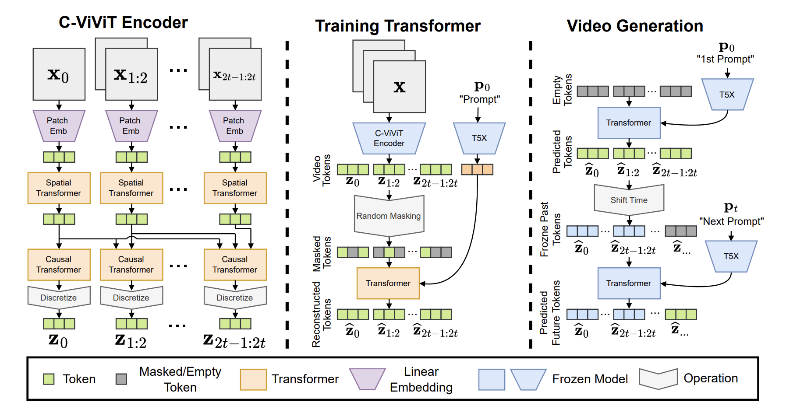

# Phenaki CViViT - Obvious Research

# Reproduction of the first step in the [text-to-video model Phenaki](https://arxiv.org/pdf/2210.02399.pdf).
## Code and model weights for the Transformer-based autoencoder for videos called CViViT.

## * Code, based on lucidrains' repo

The code is heavily based [on the reproduction of Phenaki](https://github.com/lucidrains/phenaki-pytorch) by the one and only [lucidrains](https://github.com/lucidrains). However, for actually training the model we had to make several modifications. Here's the list of modifications compared to the original repo:

- added i3d video loss
- loss weights, architecture parameters, optimizer parameters closer to paper
- added learning rate schedulers (warmup + annealing)
- added webdataset integration
- added video data preprocessing (8fps, 11 frames per videos as in the paper)
- added vq L2 factorized codes (once again thanks to lucidrains)
- code is now compatible for multi GPU and multi node training
- added accelerate wandb integration
- added visualisation scripts
- minor bug fixes

## * Model weight release, on Huggingface

We release the model weights of our best training on [HuggingFace](https://huggingface.co/obvious-research/phenaki-cvivit) . The model is trained on the Webvid-10M dataset on a multi-node multi-gpu setup. 

As the model CViViT is an autoencoder for videos, here are examples of videos and reconstructions created by the model:

With our logo at Obvious:

With the famous blue/red pill from Matrix:

## * Usage for inference

You can use the notebook CViViT_inference.ipynb to test the released model. First, download CVIVIT and frozen_models folders from [Huggingface](https://huggingface.co/obvious-research/phenaki-cvivit) and place them in the current repository. Then you should be able to run the notebook normally. Please note that input images to the model should be 8 FPS videos of 11 frames.

## * Next steps

We are working on the second part of training of Phenaki, which actually yields the full text-to-video model. 

We appreciate any help, feel free to reach out! You can contact us:

- On Twitter: [@obv_research](https://twitter.com/obv_research)
- By mail: research.obvious@gmail.com

## * About Obvious Research

Obvious Research is an Artificial Intelligence research laboratory dedicated to creating new AI artistic tools, initiated by the artists’ trio [Obvious](https://obvious-art.com/), in partnership with La Sorbonne Université.

